# Simple Docker

Введение в докер. Разработка простого докер образа для собственного сервера.

## Part 1. Готовый докер

**== Задание ==**

##### Возмем официальный докер образ с **nginx** и выкачаем его при помощи `docker pull`

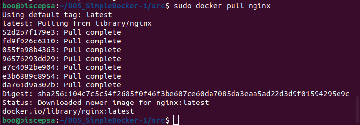  *`docker pull nginx`*  

##### Проверим наличие докер образа через `docker images`

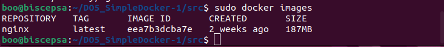  *наличие докер образа*  

##### Запустим докер образ через `docker run -d [image_id|repository]` и
##### проверяем, что образ запустился через `docker ps`

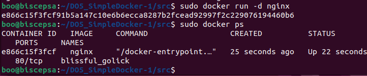  *`docker run -d nginx` и `docker ps`*  

##### Посмотряем информацию о контейнере через `docker inspect [container_id|container_name]`

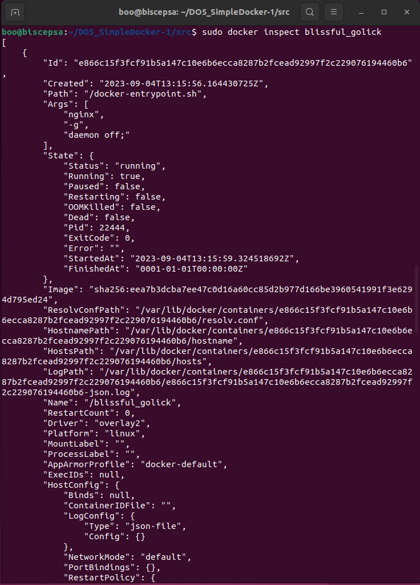  *информация о контейнере*  

##### Определяем размер контейнера, список замапленных портов и ip контейнера

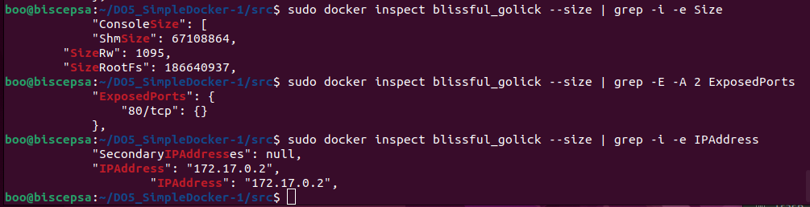  *информация о размере контейнера, списке замапленных портов и об ip контейнера*  

##### Остановим докер образ через `docker stop [container_id|container_name]` и
##### проверим, что образ остановился через `docker ps`

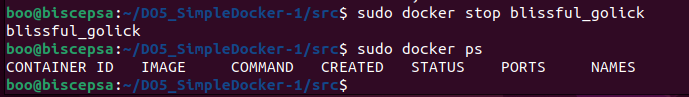  *Остановим докер образ и проверим отсутствие*  

##### Запустим докер с портами 80 и 443 в контейнере, замапленными на такие же порты на локальной машине, через команду *run* и
##### проверим, что в браузере по адресу *localhost:80* доступна стартовая страница **nginx**

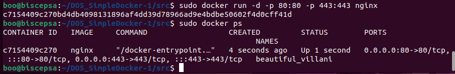  *Запустим докер с портами 80 и 443*  

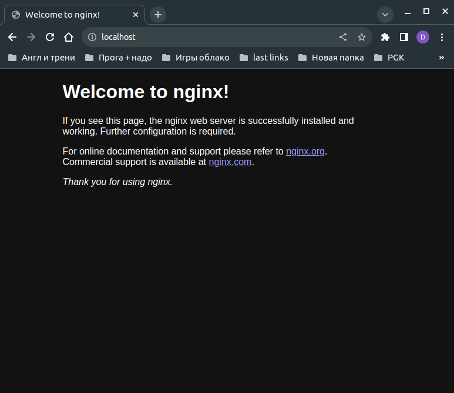  *по адресу localhost:80 доступна стартовая страница*  

##### Перезапустим докер контейнер через `docker restart [container_id|container_name]`
##### и проверим, что контейнер запустился

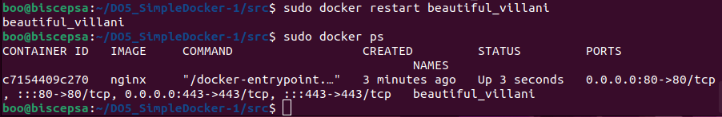  *перезапуск и проверка докер контейнера*  

## Part 2. Операции с контейнером

**== Задание ==**

##### Прочитаем конфигурационный файл *nginx.conf* внутри докер контейнера через команду *exec*

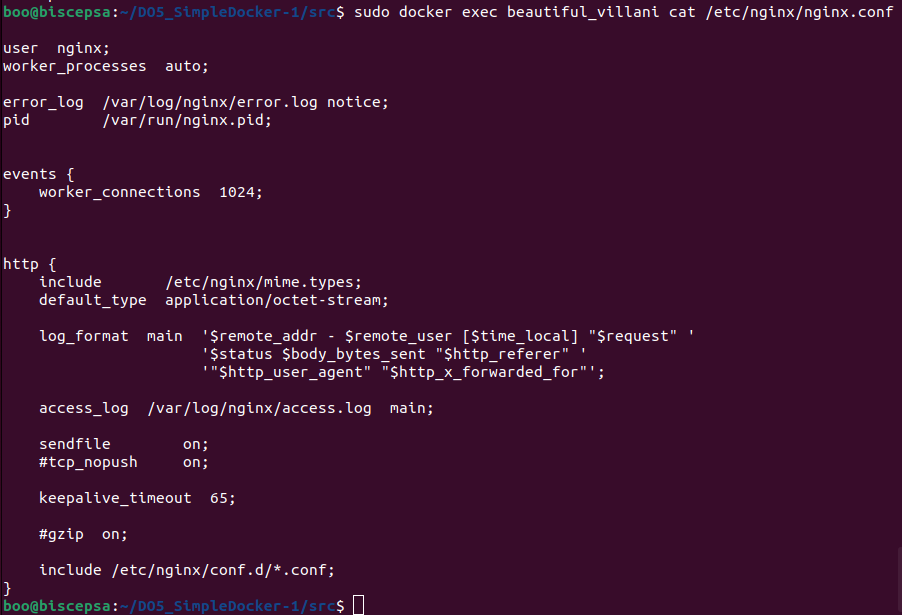  *конфигурационный файл nginx.conf*  

##### Создаем на локальной машине файл *nginx.conf*
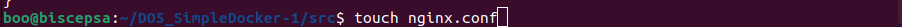  *создаем конфигурационный файл nginx.conf*  

##### Настроим в нем по пути */status* отдачу страницы статуса сервера **nginx**

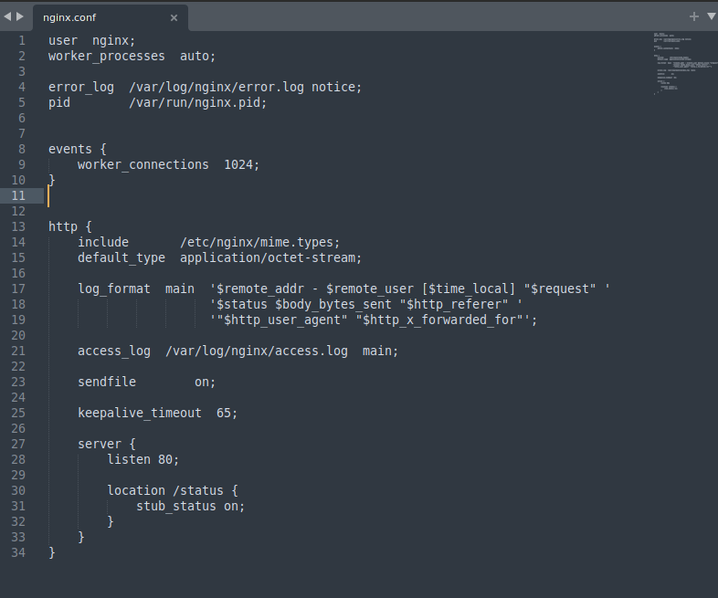  *настроим пути в файле nginx.conf*  

##### Скопируем созданный файл *nginx.conf* внутрь докер образа через команду `docker cp` и
##### перезапустим **nginx** внутри докер образа через команду *exec*

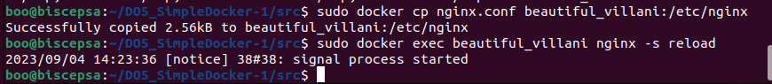  *скопируем файл nginx.conf и перезапустим nginx*  

##### Проверим, что по адресу *localhost:80/status* отдается страничка со статусом сервера **nginx**

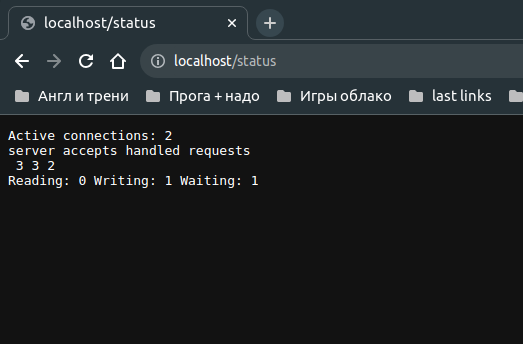  *localhost:80/status*  

##### Экспортируем контейнер в файл *container.tar* через команду *export* и
##### остановим контейнер

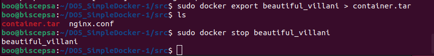  *Экспортируем контейнер и после остановим его*  

##### Удалим образ через `docker rmi [image_id|repository]`, не удаляя перед этим контейнеры и
##### удалим остановленный контейнер

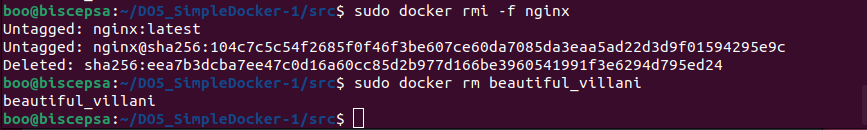  *Удалим образ, а затем контейнер*  

##### Импортируем контейнер обратно через команду *import*
##### и запустить импортированный контейнер

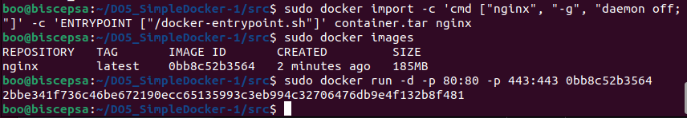  *Импортруем и запустим контейнер*  

##### Проверим, что по адресу *localhost:80/status* отдается страничка со статусом сервера **nginx**

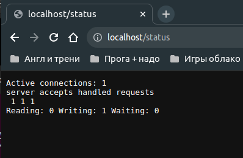  *localhost:80/status*  

## Part 3. Мини веб-сервер

**== Задание ==**

##### Напишем мини сервер на **C** и **FastCgi**, который будет возвращать простейшую страничку с надписью `Hello World!`, а также nginx.conf, который будет проксировать все запросы с порта 81 на порт *127.0.0.1:8080*

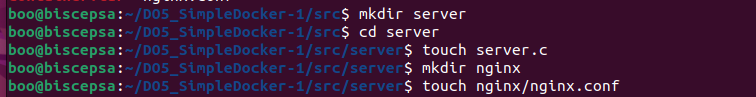  *создание файлов в папке server*  

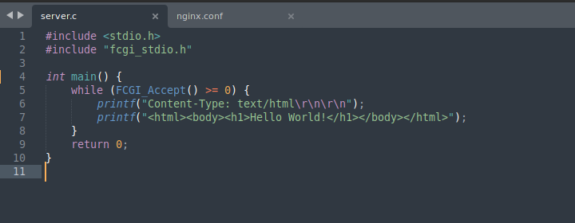  *файл server.c*  

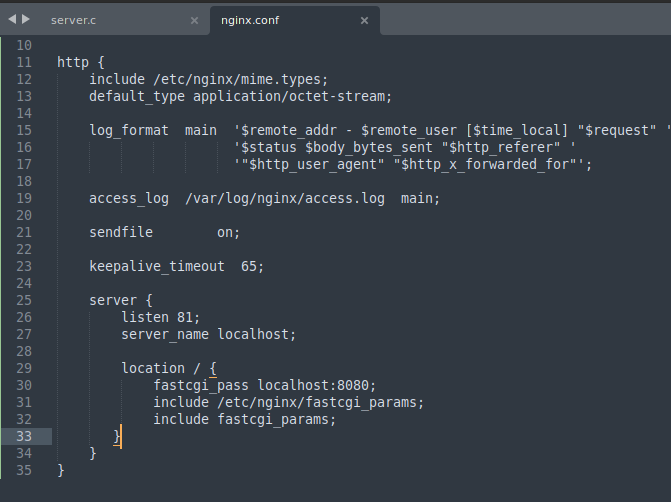  *файл nginx.conf*  

##### Запустим написанный мини сервер через *spawn-fcgi* на порту 8080

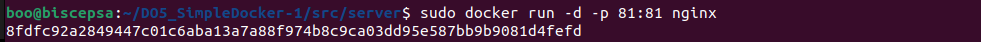  *Запустим написанный мини сервер*  

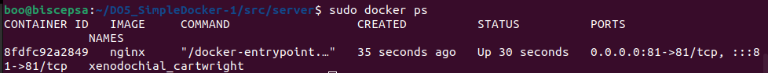  *Проверка и получение имени*  

##### Скопируем *nginx.conf* и *server.c* в новый контейнер

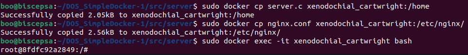  *Копирование nginx.conf и server.c в новый контейнер*  

##### Установим требуемые утилиты для запуска мини веб-сервера на FastCGI, в частности `spawn-fcgi` и `libfcgi-dev`

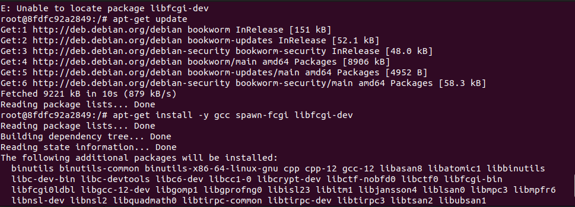  *Установим требуемые утилиты*  

##### Cкомпилируем и запустим мини веб-сервер через команду spawn-fcgi

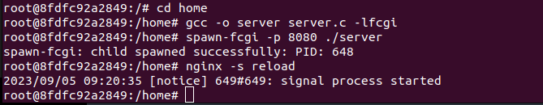  *Запуск мини веб сервера*  

##### Проверим, что в браузере по *localhost:81* отдается написанная вами страничка

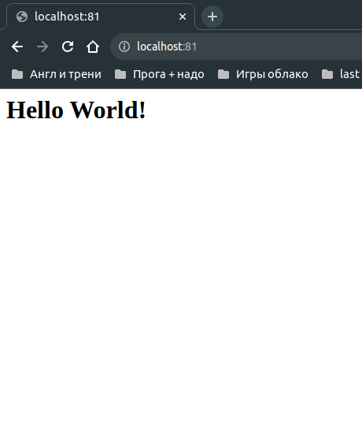  *localhost:81*  

##### Положим файл *nginx.conf* по пути *./nginx/nginx.conf* (это понадобится позже)

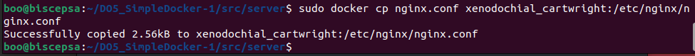  *nginx.conf по пути ./nginx/nginx.conf*  

## Part 4. Свой докер

**== Задание ==**

#### Написать свой докер образ, который:
##### 1) собирает исходники мини сервера на FastCgi из [Части 3](#part-3-мини-веб-сервер)
##### 2) запускает его на 8080 порту
##### 3) копирует внутрь образа написанный *./nginx/nginx.conf*
##### 4) запускает **nginx**.

##### Файлы *nginx.conf* и *server.c* остаются с 3 части.
##### Создадим файл *run.sh* и *Dockerfile*

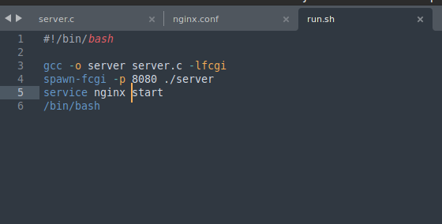  *файл run.sh*  

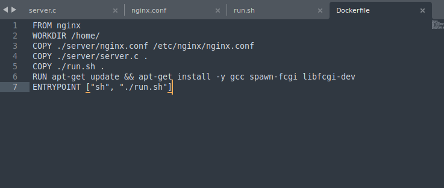  *файл Dockerfile*  

##### Собрем написанный докер образ через `docker build` при этом указав имя и тег

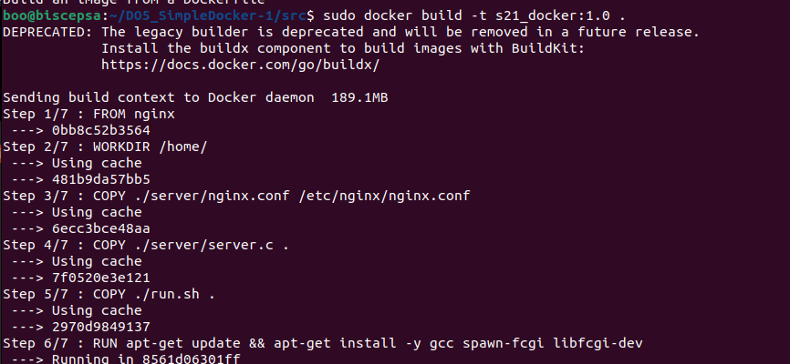  *Сборка написанного докер образа*  

##### Проверим через `docker images`, что все собралось корректно

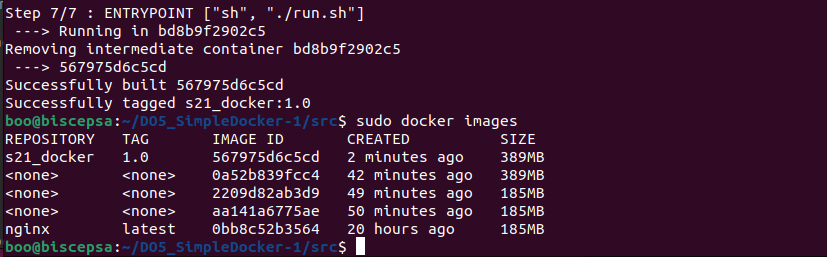  *Проверка*  

##### Запустим собранный докер образ с маппингом 81 порта на 80 на локальной машине и маппингом папки *./nginx* внутрь контейнера по адресу, где лежат конфигурационные файлы **nginx**'а (см. [Часть 2](#part-2-операции-с-контейнером))

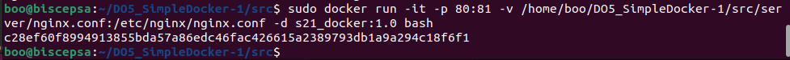  *Запуск собранного докер образа*  

##### Проверим, что по localhost:80 доступна страничка написанного мини сервера

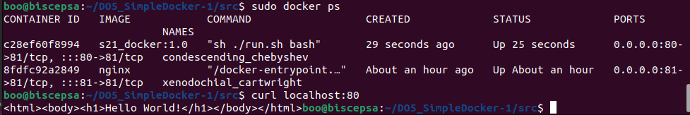  *Проверка в терминале*  

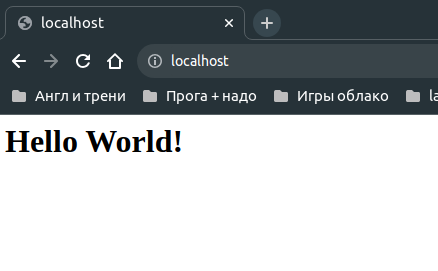  *localhost:80*  

##### Допишем в *nginx.conf* проксирование странички */status*, по которой надо отдавать статус сервера **nginx**

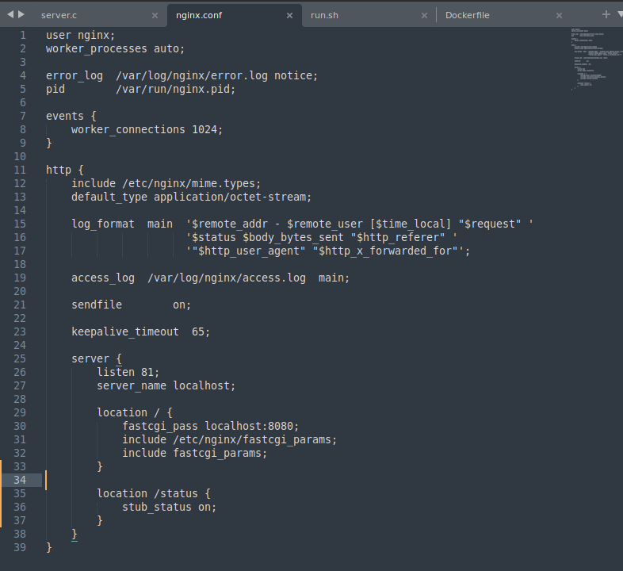  *nginx.conf проксирование странички /status*  

##### Перезапустим докер образ
 
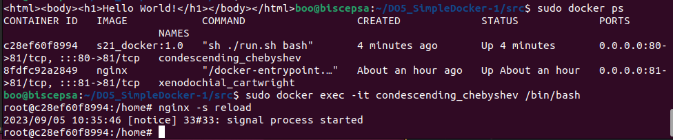  *Перезапуск*  

##### Проверим, что теперь по *localhost:80/status* отдается страничка со статусом **nginx**

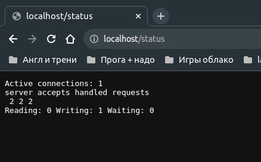  *localhost:80/status*  

## Part 5. **Dockle**

После написания образа никогда не будет лишним проверить его на безопасность.

**== Задание ==**

##### Просканируем образ из предыдущего задания через `dockle [image_id|repository]`

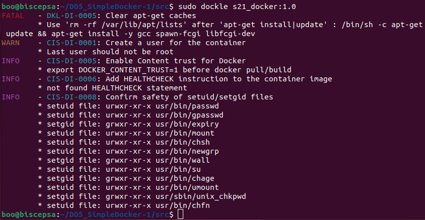  *Просканируем образ `dockle`*  

##### Исправим образ так, чтобы при проверке через **dockle** не было ошибок и предупреждений

Исправим Dockerfile

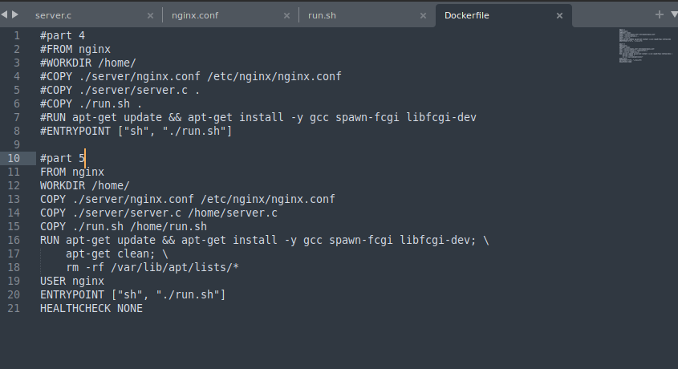  *Исправим Dockerfile* 

##### Переапустим образ и
##### снова просканируем образ из предыдущего задания через `dockle`

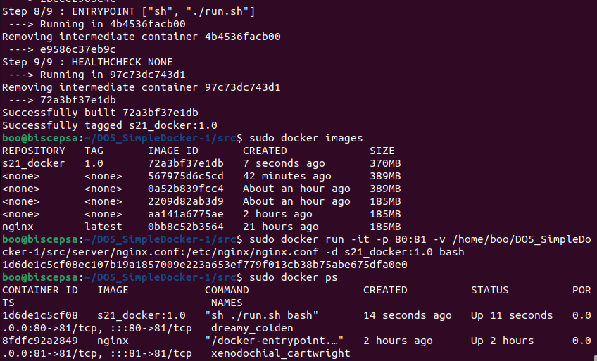  *Перезапустим* 

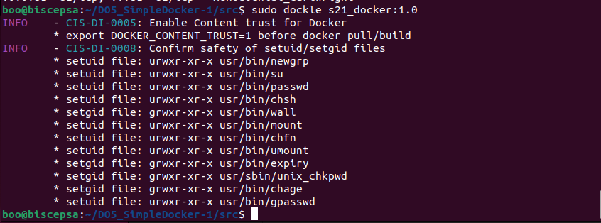  *Просканируем образ `dockle`*  

## Part 6. Базовый **Docker Compose**

**== Задание ==**

##### Напишем файл *docker-compose.yml*, с помощью которого надо:
##### 1) Поднять докер контейнер из [Части 5](#part-5-инструмент-dockle) _(он должен работать в локальной сети, т.е. не нужно использовать инструкцию **EXPOSE** и мапить порты на локальную машину)_
##### 2) Поднять докер контейнер с **nginx**, который будет проксировать все запросы с 8080 порта на 81 порт первого контейнера

##### Для начала остановм все запущенные контенеры

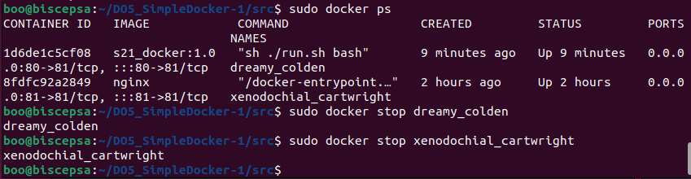  *остановм все запущенные контенеры*  

##### Напишем файл *docker-compose.yml*

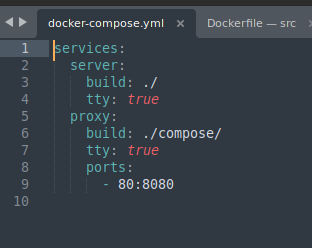  *docker-compose.yml*  

Чтобы не изменять конфигурационные файлы, будем собирать из папки compose, запуск будет происходить из этой папки.

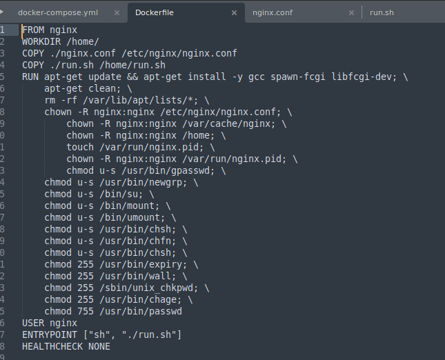  *Dockerfile*  

##### Замапим 8080 порт второго контейнера на 80 порт локальной машины

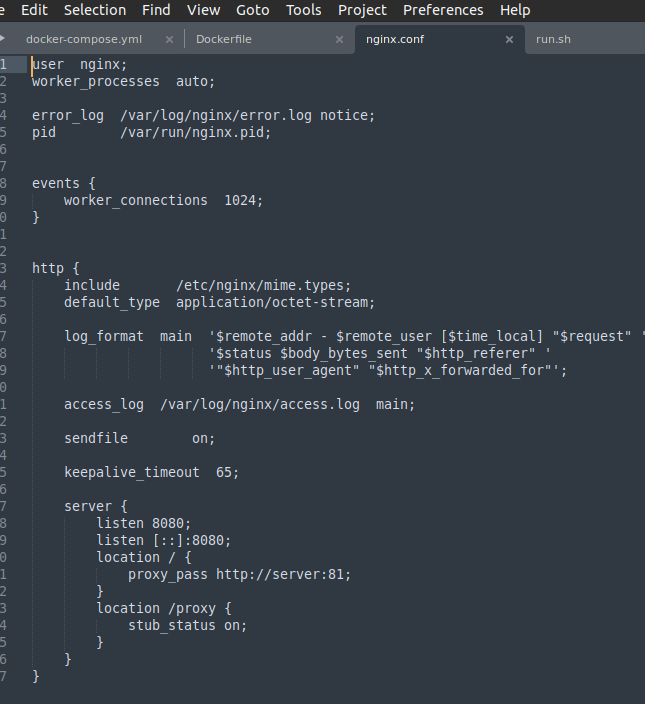  *nginx.conf*  

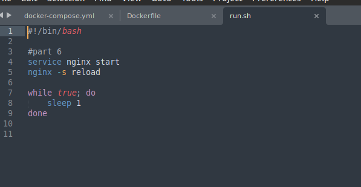  *run.sh*  

##### Собрем и запустим проект с помощью команд `docker-compose build` и `docker-compose up`

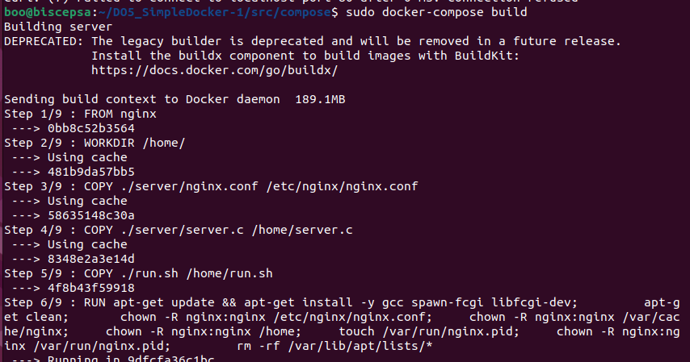  *Сборка проекта*  

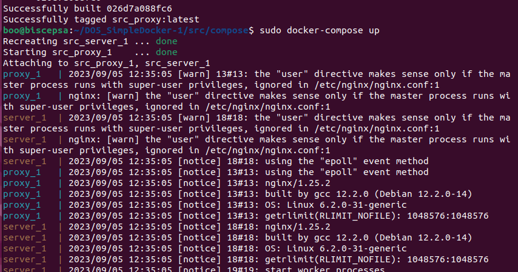  *Запуск проекта*  

##### Проверим, что в браузере по *localhost:80* отдается написанная вами страничка

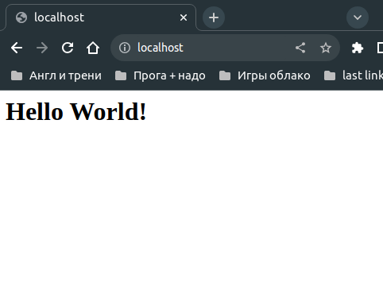  *localhost:80*  

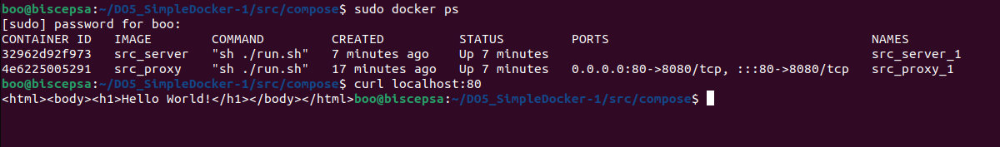  *Проверка через терминал*  